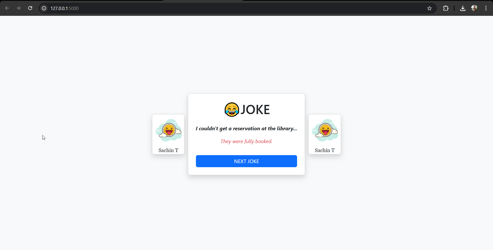

# 😂 Flask Joke App

A simple web application built with **Flask** that displays random jokes fetched from an API. 

---

## 🔹 Features

- Fetches random jokes from **Joke API**
- Click next button for next joke
- Responsive design with **Bootstrap**
- Easy to run locally or deploy with **Docker**
- Ready for **CI/CD** with GitHub Actions

---

## 🛠️ Tech Stack

- Python 3.x
- Flask
- HTML / CSS / Bootstrap
- JavaScript (for animations)
- Docker (optional, for containerized deployment)

---

## ⚡ Setup & Run Locally

1. Clone the repository:
```bash
git clone https://github.com/yourusername/joke-app.git
cd joke-app
```

2. Create virtual environment:
```bash
python -m venv venv
```

3. Activate virtual environment:

- Windows:
```bash
venv\Scripts\activate
```
- Linux/macOS:
```bash
source venv/bin/activate
```

4. Install dependencies:
```bash
pip install -r requirements.txt
```

5. Run the app:
```bash
python main.py
```

6. Open your browser and visit:
```
http://127.0.0.1:5000/
```

---

## 🐳 Run with Docker

1. Build Docker image:
```bash
docker build -t flask-joke-app .
```

2. Run Docker container:
```bash
docker run -p 5000:5000 flask-joke-app
```

3. Visit in browser:
```
http://localhost:5000/
```

---

## 📦 CI/CD

- Ready to use **CI/CD** workflow
- Push to `main` branch → Docker image builds → Auto deployment possible
- Docker Hub, ACR recommended for storing images

---

## 🎨 Screenshots



---

## 🔹 Contributing

1. Fork the repository  
2. Create a new branch: `git checkout -b feature-name`  
3. Commit changes: `git commit -m "Add feature"`  
4. Push branch: `git push origin feature-name`  
5. Open a Pull Request  

---

## 📄 License

This project is licensed under the MIT License.

